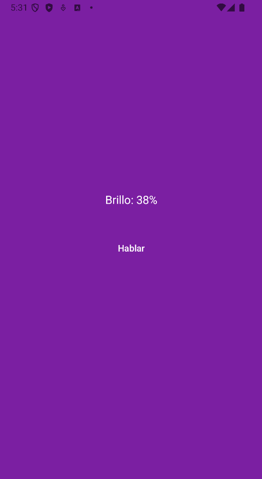
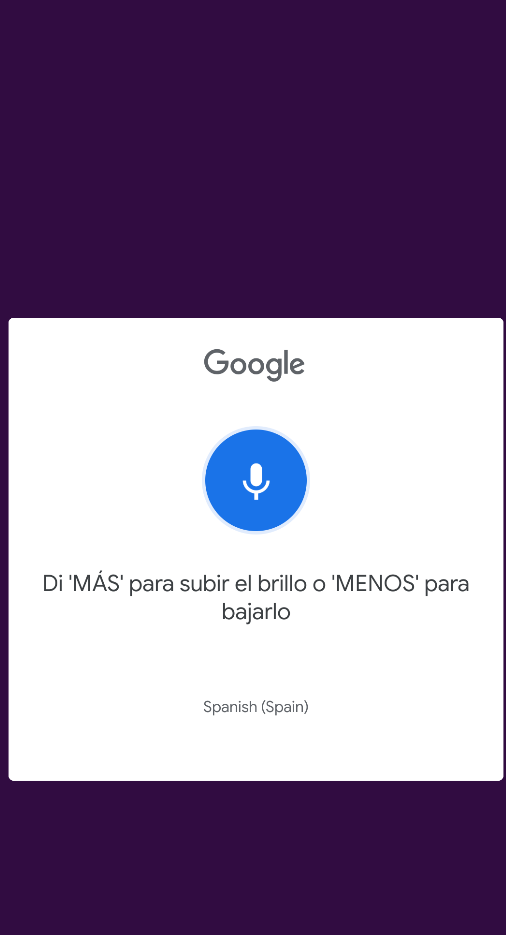

# App NUI-VUI Control de Brillo por Voz

Aplicación móvil desarrollada en Java para Android basada en interacción NUI/VUI, permitiendo controlar el brillo del dispositivo mediante comandos de voz.

## Características

* Reconocimiento de voz en español
* Control dinámico del brillo del dispositivo
* Comandos de voz para aumentar, disminuir o silenciar el brillo
* Cambio automático del color de la interfaz según el nivel de brillo
* Gestión de permisos del sistema Android
* Interfaz sencilla orientada a accesibilidad e interacción natural

## Tecnologías utilizadas

* Java
* Android Studio
* RecognizerIntent (Speech Recognition)
* Android SDK
* Gestión de permisos del sistema
* Git y GitHub

## Comandos disponibles

* “Más” → aumenta el brillo
* “Menos” → disminuye el brillo
* “Silenciar” o “Mínimo” → establece el brillo al mínimo

## Capturas

### Pantalla principal

### Control de brillo por voz

